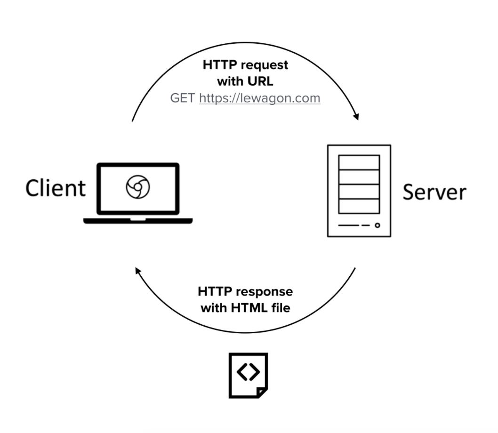

## How does a website works ?

### 2 machines are communicating

- a client (your browser)
- a server

They communicate based on a common protocol : *Hyper Text Transfer Protocol* (HTTP)

### Web != Internet

Internet is the wire and machines connected 
Web is the what is transferred using the HTTP 
It is thus a subset of the Internet

### HTTP is used to transfer ressources (=files)

It is based on a system of requests of responses between a client and a server.
Anytime a user makes an action on a website it will send a request (GET request) to a server. 
In cas of a simple static website the server will just fetch the HTML page and send it to the client. 
In case of a more complex dynamic site the sever will build the HTML page to send using the backend of the site. 
Then the browser will process the HTML file to display the web page to the user.

### HTTP Diagram

